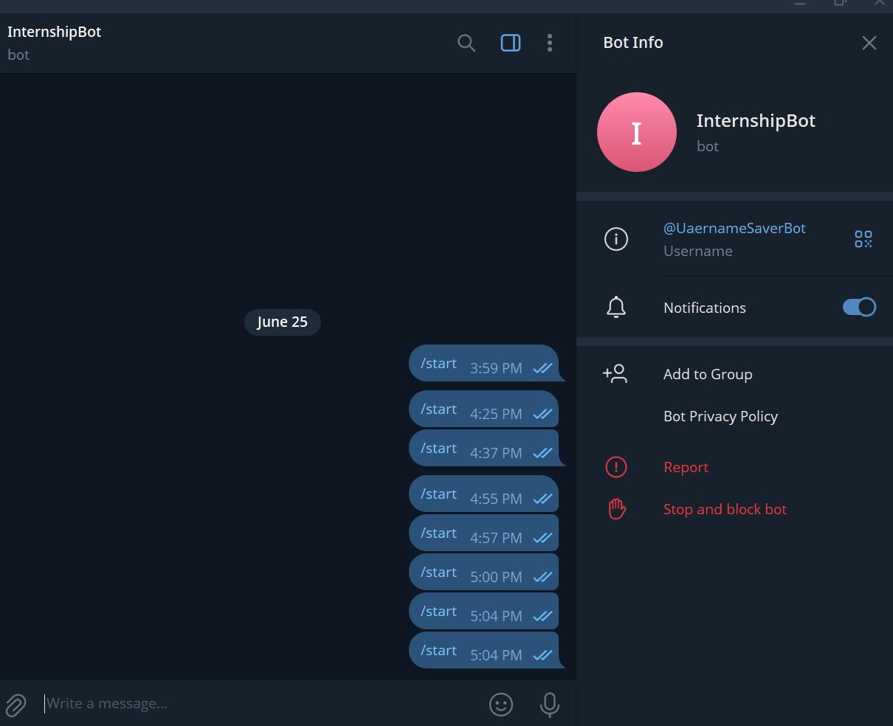
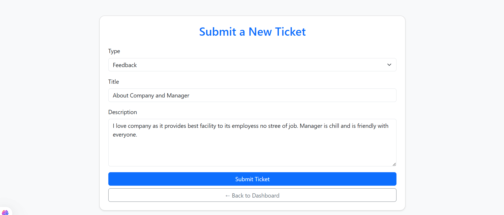
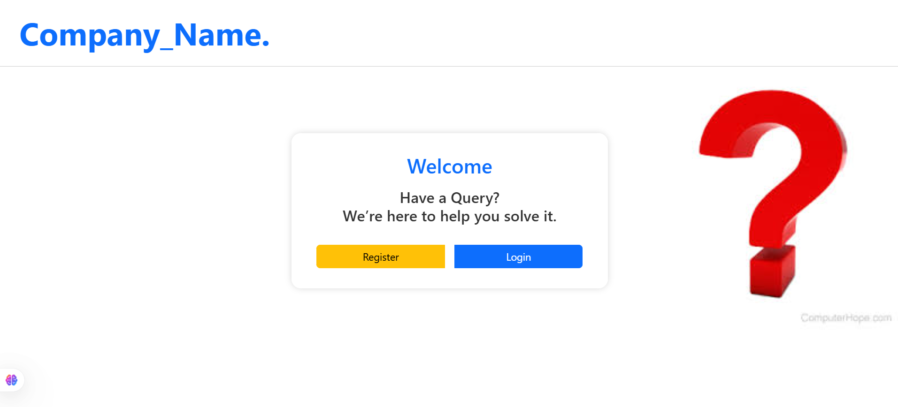
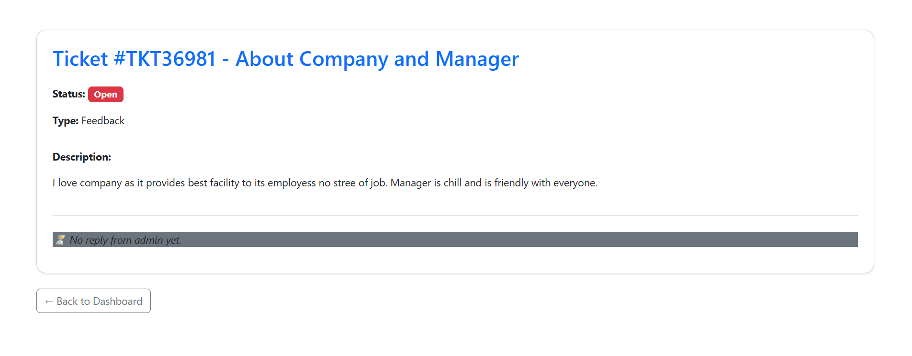

Project Idea/Name : Complaint Portal 

🛠️ Complaint Portal
  A user-friendly complaint/feedback/query management system built using Django and Django REST Framework, featuring user login/register, 
  ticket creation, admin panel to manage tickets, email alerts, and optional Telegram bot integration.

📁 Project Structure
  Django Practice/
  ├── accounts/                # Handles login, registration, landing
  ├── complaints/              # Manages tickets, dashboard, admin view
  ├── telegram_bot/            # Telegram integration
  ├── myproject/               # Project settings
  ├── db.sqlite3               # Local DB
  ├── manage.py
  └── .env                     # Secure config (excluded from Git) [Have secret_key, email to send registration confirmation, password ]

  git clone https://github.com/yourusername/complaint-portal.git

  Set up .env file

** Create a .env file in the root:
    SECRET_KEY=your_django_secret_key
    EMAIL_HOST_USER=your_email@gmail.com
    EMAIL_HOST_PASSWORD=your_app_password

** Run Migrations :
    python manage.py makemigrations
    python manage.py migrate

** Create superuser (admin)
    python manage.py createsuperuser

🔐 Environment Variables Used
  Key	                              Purpose
SECRET_KEY	                    Django secret key
EMAIL_HOST_USER	                Gmail account for sending emails
EMAIL_HOST_PASSWORD	            Gmail App Password (NOT your password)

📩 Main Functionalities
  / → Landing page
  /accounts/register/ → User registration
  /accounts/login/ → User login
  /complaints/dashboard/ → User dashboard (submit/view tickets)
  /complaints/admin-panel/ → Admin panel (manage all tickets)

🔌 API Endpoints (Basic)
Method	      Endpoint	                               Description
  GET	      /accounts/login/	                        Render login page
  POST	    /accounts/login/	                        Login user
  POST	    /accounts/register/	                      Register a user + send email
  GET	      /complaints/dashboard/	                  Show user tickets
  POST	    /complaints/new-ticket/	                  Submit new ticket
  GET	      /complaints/admin-panel/	                Admin view for all tickets
  POST	    /complaints/admin-panel/<ticket>/	        Admin replies, update status

⚠️ Admin panel protected with is_staff decorator.

🧪 Telegram Bot
curl -X POST "https://api.telegram.org/bot<YOUR_TOKEN>/setWebhook?url=https://<ngrok-url>/telegram/webhook/"

✅ TODO Features :
   User login/register
   Complaint dashboard
   Admin response system
   Email notifications (After Registering)
   Telegram Bot : message /start the username will be stored in db 

## 📸 Project Screenshots

### 🧠 Telegram Bot Connected

### 🏠 User Dashboard

### 📝 Submit New Ticket

### 🧭 Landing Page

### 📩 View Admin Reply to Ticket

📦 requirements.txt
    Django>=4.2,<5.3
    djangorestframework>=3.14
    python-decouple>=3.8

📝 License :
    This project is for educational/demo use.
this is my readme.md
